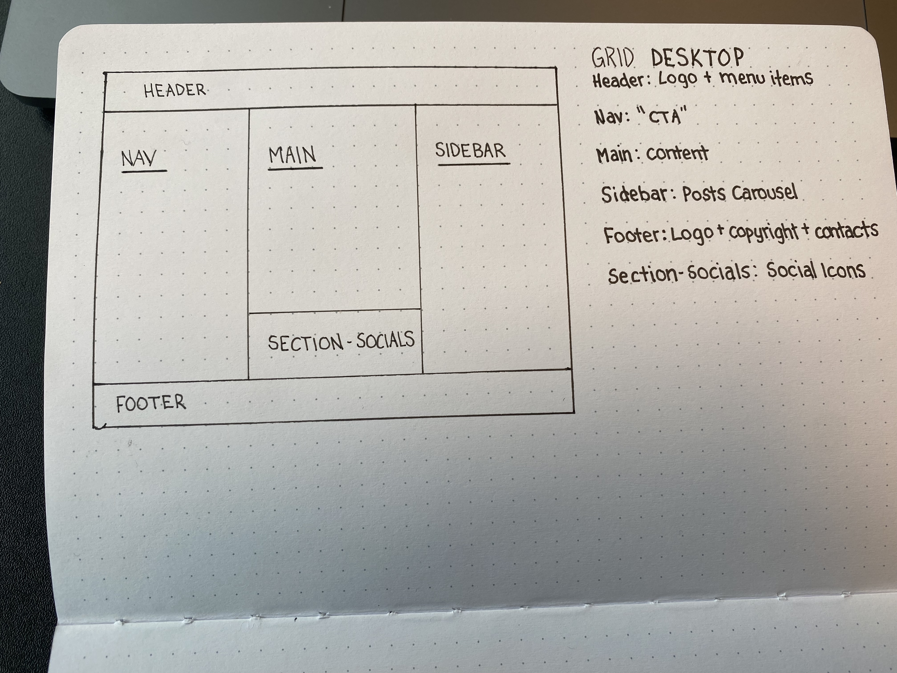
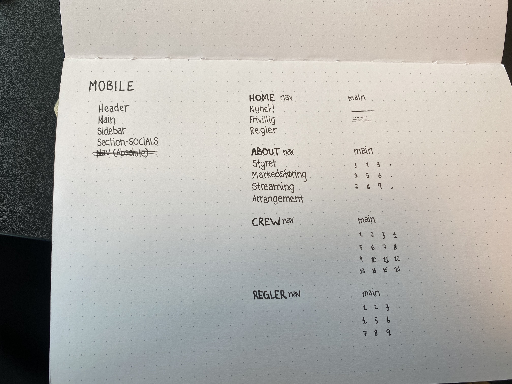
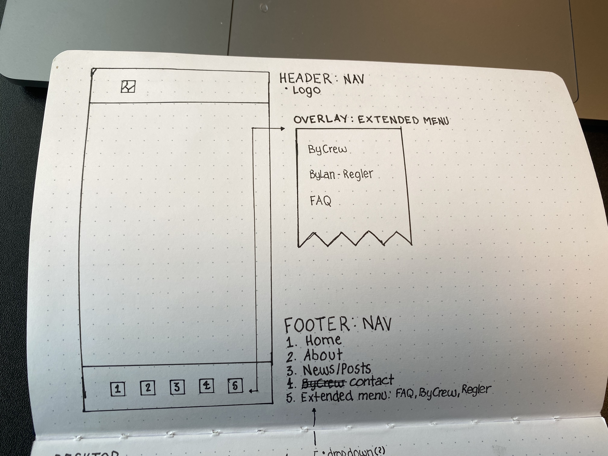
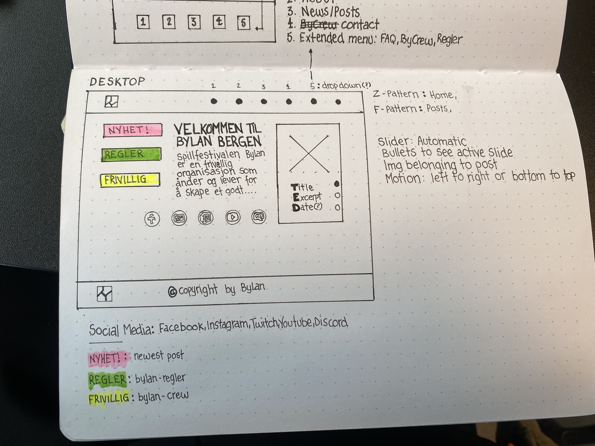
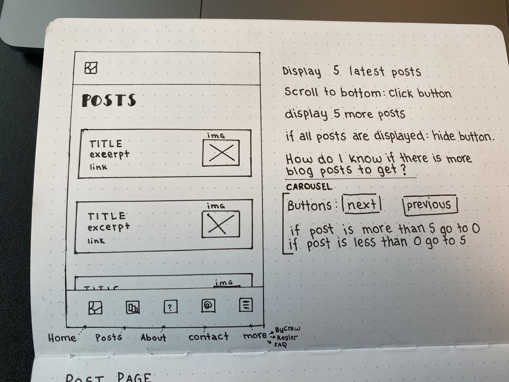
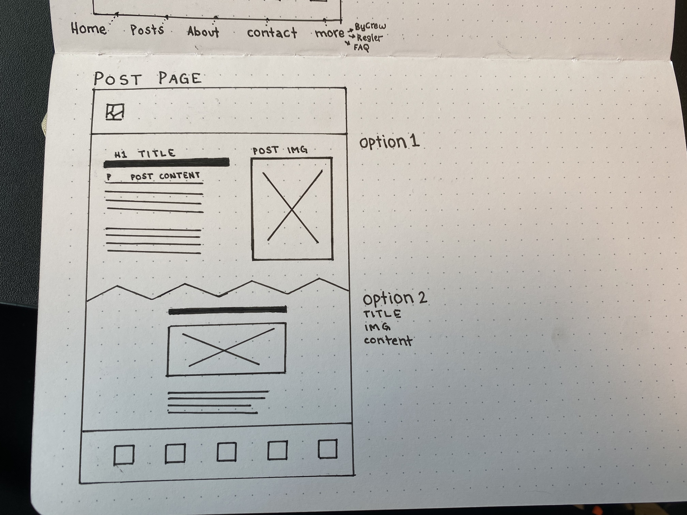

#Project Exam 1

###Links
**GitHub:** bylan-exam  
**Website:** bylan-exam

--- 
--- 

##Intro

####Drawing up the parts of the website for desktop

####In the different parts of the website I wanted to map out the sections

####Noting what pages I needed and wrote down an idea for mobile-menu

####Drawing up an idea for the home page

####Drawing up an idea for the posts/news page

####Drawing up an idea for the post/details page

---

##Main

---

##Conclusion

--- 
--- 

##Resources
* **[LOGO](https://www.avena.dev/exam/wp-content/uploads/2022/05/final-logo.png)**
* ####Example: [Carousel](https://blog.logrocket.com/build-image-carousel-from-scratch-vanilla-javascript/)
* ####Codepen: [Infinite Loop Slider](https://codepen.io/abcretrograde/pen/povVxVq?editors=0010)
* ####Codepen: [Responsive Website](https://codepen.io/codingtuting/pen/VwZBzxw)
* ####Codepen: [Responsive Grid Layout](https://codepen.io/DuskoStamenic/pen/qBVwyrY?editors=1100)
* ####Carousel: [Used](https://blog.logrocket.com/build-image-carousel-from-scratch-vanilla-javascript/)
* ####Promises: [Codeblock](https://www.demo2s.com/javascript/javascript-promise-composing-promises-and-non-promise-values.html)
* ####Carousel: [StackOverflow](https://stackoverflow.com/questions/46960391/vanilla-javascript-slider-not-working)
* ####Codepen: [Link](https://codepen.io/xiaolasse/pen/yLgdLvm?editors=1011)